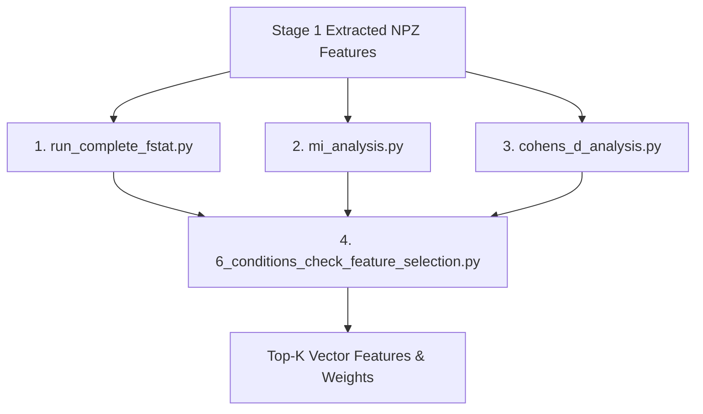

# STAGE 2: Feature Selection & Steering Vector Creation

> **Location:** [`STAGE-2_feature-selection and vector creation`](file:///E:/SAE-STATSTEER/STAGE-2_feature-selection%20and%20vector%20creation)  
> **Pipeline Phase:** Stage 2 of 4

---

## 🎯 1. Objective of this Folder

The objective of **Stage 2** is to identify reliable, high-effect SAE features from the Stage 1 feature activation matrices and rank them to construct steering directions.

To eliminate noisy or non-generalizable features, Stage 2 performs:
1. **Three-Statistic Evaluation:** Evaluates features across $F$-statistic (linear separation), KSG Mutual Information (non-linear dependency), and Cohen's $d$ (signed effect size).
2. **6-Condition Quality Filtering (C1–C6):** Enforces activity rate floors ($\ge 1\%$), positive directional alignment ($d > 0$), bootstrap CI stability ($d_{\text{lower}}^{\text{boot}} > 0$), effect size thresholds ($|d| \ge 0.2$), MI stability ($CV < 0.5$), and FDR significance ($q < 0.05$).
3. **2-Tier Unweighted Borda Consensus:** Ranks features surviving the quality gate into High-Confidence (top 300 across all 3 stats) and Medium-Confidence (top 300 across 2 stats) tiers.
4. **Vector Payload Generation:** Exports top-$K$ ($K \in \{16, 24, 32\}$) feature indices and signed Cohen's $d$ weighting vectors for residual lifting in Stage 3.

---

## 🚀 2. How to Run the Scripts & Execution Order

Execution must follow a 4-step sequence (Steps 1–3 can run independently or in parallel; Step 4 consumes their outputs):



### Step 1: Run One-Way ANOVA $F$-Statistic Analysis
Calculates feature activity rates, class means, $F$-values, and $p$-values.

```bash
python scripts/run_complete_fstat.py \
    --base_dir ./results/sae_features \
    --out_dir ./results/fstat_complete \
    --layers 12 16 19 23
```

### Step 2: Run KSG Mutual Information Analysis
Computes non-parametric debiased Mutual Information ($k=3$) with 20 bootstrap iterations.

```bash
python scripts/mi_analysis.py \
    --base_dir ./results/sae_features \
    --out_dir ./results/mi_complete \
    --layers 12 16 19 23
```

### Step 3: Run Cohen's $d$ Effect Size Analysis
Computes signed Cohen's $d$, Hedges' $g$, Glass's $\Delta$, and 95% bootstrap confidence intervals.

```bash
python scripts/cohens_d_analysis.py \
    --base_dir ./results/sae_features \
    --out_dir ./results/cohen_complete \
    --layers 12 16 19 23
```

### Step 4: Run Unified 6-Condition Quality Gate & Borda Selection
Consolidates the three statistical outputs, applies C1–C6 filters, ranks features via 2-tier Borda consensus, and saves top-$K$ vector configurations.

```bash
python scripts/6_conditions_check_feature_selection.py \
    --fstat_dir ./results/fstat_complete \
    --mi_dir ./results/mi_complete \
    --cohen_dir ./results/cohen_complete \
    --out_dir ./results/selected_features
```

---

## 📥 3. Required Inputs for Each Script

### Script 1: [`scripts/run_complete_fstat.py`](file:///E:/SAE-STATSTEER/STAGE-2_feature-selection%20and%20vector%20creation/scripts/run_complete_fstat.py)
* **Inputs:**
  * `--base_dir`: Directory containing Stage 1 `.npz` files (`layer_XX_all_sae_features.npz`).
  * `--layers`: Target layer numbers to analyze.
* **Outputs:** CSV summaries (`fstat_full_layer_XX.csv`), top-$K$ rankings, and JSON summary statistics.

### Script 2: [`scripts/mi_analysis.py`](file:///E:/SAE-STATSTEER/STAGE-2_feature-selection%20and%20vector%20creation/scripts/mi_analysis.py)
* **Inputs:**
  * `--base_dir`: Directory containing Stage 1 `.npz` files.
  * `--layers`: Target layer numbers.
  * `--n_neighbors`: KSG $k$-NN parameter (default: `3`).
  * `--n_bootstraps`: Bootstrap resamples for stability assessment (default: `20`).
* **Outputs:** CSV summaries with debiased MI scores and CV metrics (`mi_full_layer_XX.csv`).

### Script 3: [`scripts/cohens_d_analysis.py`](file:///E:/SAE-STATSTEER/STAGE-2_feature-selection%20and%20vector%20creation/scripts/cohens_d_analysis.py)
* **Inputs:**
  * `--base_dir`: Directory containing Stage 1 `.npz` files.
  * `--layers`: Target layer numbers.
  * `--n_bootstraps`: Bootstrap resamples for 95% CI estimation (default: `100`).
* **Outputs:** CSV files with signed Cohen's $d$, Hedges' $g$, Glass's $\Delta$, and lower CI bounds (`cohen_full_layer_XX.csv`).

### Script 4: [`scripts/6_conditions_check_feature_selection.py`](file:///E:/SAE-STATSTEER/STAGE-2_feature-selection%20and%20vector%20creation/scripts/6_conditions_check_feature_selection.py)
* **Inputs:**
  * `--fstat_dir`: Output directory from Step 1 containing $F$-stat CSVs.
  * `--mi_dir`: Output directory from Step 2 containing MI CSVs.
  * `--cohen_dir`: Output directory from Step 3 containing Cohen's $d$ CSVs.
  * `--out_dir`: Destination directory for selected top-$K$ feature definitions.
* **Outputs:** Consolidated top-$K$ feature tables, Borda rank assignments, and vector initialization weights (`v_init.npy`, `feature_indices.npy`).
