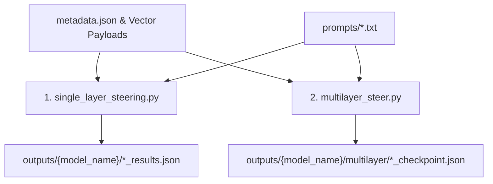

# STAGE 3: Steering and Inference Generation

> **Location:** [`STAGE-3-Steering and Getting Output`](file:///E:/SAE-STATSTEER/STAGE-3-Steering%20and%20Getting%20Output)  
> **Pipeline Phase:** Stage 3 of 4

---

## 🎯 1. Objective of this Folder

The objective of **Stage 3** is to perform inference-time activation steering on target LLMs (Gemma 2 2B, Gemma 2 9B, Gemma 3 4B) using the constructed SAE vector directions.

During generation, PyTorch forward hooks are attached to target residual stream layers to modify the last-token residual state $h$ at each step:
$$h_{:, -1, :} \leftarrow h_{:, -1, :} + \alpha \|h_{:, -1, :}\|_2 \hat{\delta h}$$

This folder supports both:
1. **Single-Layer Steering:** Evaluates individual candidate layers across a grid of strength values $\alpha \in \{0, 0.1, 0.2, 0.3, 0.5, 0.7, 1.0, 1.5, 2.0\}$.
2. **Multi-Layer Composition:** Composes quality-positive single-layer directions across 2–3 layers with budget-allocated total strength $\alpha_{\text{total}} \in \{0.1, 0.2, 0.3, 0.5, 0.7, 1.0\}$.

---

## 🚀 2. How to Run the Scripts & Execution Order

Execution can be performed for single-layer experiments, multi-layer experiments, or both in sequence:



### Setup Requirement
Ensure a HuggingFace authentication token is saved in `token.txt`:
```bash
echo "your_hf_token_here" > token.txt
```

### Option A: Run Single-Layer Steering Grid
Executes single-layer steering across all 4 domains (`LOGIC`, `MORAL`, `POLITIC`, `SENTIMENT`) and all candidate layers.

```bash
python single_layer_steering.py
```
*When prompted for `Model Name:`, enter `gemma-2-2b`, `gemma-2-9b`, or `gemma-3-4b`.*

### Option B: Run Multi-Layer Steering Composition
Executes multi-layer composed steering across domains using layer weights from `multilayer_metadata.json`.

```bash
python multilayer_steer.py
```
*When prompted for `Model Name:`, enter `gemma-2-2b`, `gemma-2-9b`, or `gemma-3-4b`.*

---

## 📥 3. Required Inputs for Each Script

### 🔑 Shared Input Dependencies
1. **`token.txt`**: Plain text file containing your HuggingFace user access token for downloading gated Gemma models (`google/gemma-2-2b`, `google/gemma-2-9b`, `google/gemma-3-4b`).
2. **`prompts/` Directory**: Contains the 100 evaluation prompt texts for each domain:
   - `logic-prompts.txt` (adapted from *LogicBench*)
   - `moral-prompts.txt` (synthetically generated ethical scenarios)
   - `politic-prompts.txt` (adapted from *Twinviews-13k*)
   - `sentiment-prompts.txt` (synthetically generated sentiment prompts)
3. **`vectors/` Directory**: Contains vector payloads (`v_init.npy`, `delta_h.npy`, `delta_h_opt.npy`, `feature_indices.npy`) for each model, domain, and target layer.

---

### Script 1: [`single_layer_steering.py`](file:///E:/SAE-STATSTEER/STAGE-3-Steering%20and%20Getting%20Output/single_layer_steering.py)
* **Configuration File:** `metadata.json` (maps models and domains to candidate layer vector directories).
* **CLI Input:** Interactive prompt requesting `Model Name` (e.g. `gemma-2-2b`).
* **Outputs Generated:**
  * `outputs/{model_name}/{domain}_{layer}_checkpoint.json` containing baseline ($\alpha=0$) and steered generations for all strength levels.

---

### Script 2: [`multilayer_steer.py`](file:///E:/SAE-STATSTEER/STAGE-3-Steering%20and%20Getting%20Output/multilayer_steer.py)
* **Configuration Files:**
  * `metadata.json`
  * `multilayer_metadata.json` (specifies target multi-layer sets and relative layer weights $w_l$).
* **CLI Input:** Interactive prompt requesting `Model Name`.
* **Outputs Generated:**
  * `outputs/{model_name}/multilayer/{domain}_multilayer_checkpoint.json` containing multi-layer steered completions across global strength budgets.

---

## 📚 Prompt Dataset References

* **Politics Prompts:** Adapted from *Twinviews-13k*:
  > Fulay et al. "On the Relationship between Truth and Political Bias in Language Models." *EMNLP 2024*.
* **Logic Prompts:** Adapted from *LogicBench*:
  > Parmar et al. "Towards Systematic Evaluation of Logical Reasoning Ability of Large Language Models." *arXiv:2404.15522*.
* **Moral & Sentiment Prompts:** Synthetically generated evaluation prompt sets.
