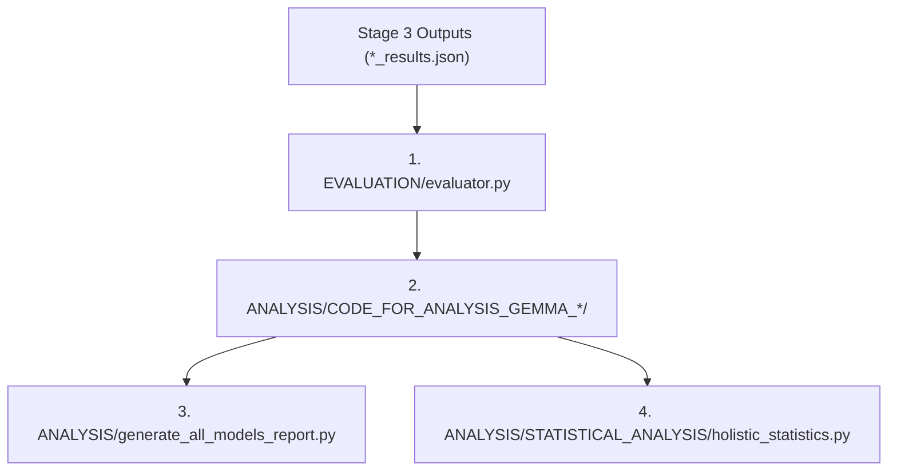

# STAGE 4: Evaluation and Analysis

> **Location:** [`STAGE-4-Evaluation and Analysis`](file:///E:/SAE-STATSTEER/STAGE-4-Evaluation%20and%20Analysis)  
> **Pipeline Phase:** Stage 4 of 4

---

## 🎯 1. Objective of this Folder

The objective of **Stage 4** is to evaluate the quality and behavioral efficacy of baseline vs. steered text outputs produced in Stage 3, and synthesize comprehensive statistical analysis across models and domains.

This stage addresses two critical requirements:
1. **Automated Multi-Judge Evaluation (`EVALUATION/`):** Evaluates steered completions against baseline completions using an LLM panel (Gemini 2.5 Flash / Pro, GPT-5.4) across four 1–10 metrics: Primary Score, Relevance Score, Richness Score, and Coherence Score.
2. **Comprehensive Paper-Facing Analysis (`ANALYSIS/`):** Computes Raw Success Rates, Quality-Conditioned Clean Success Rates, layer-depth correlations, and domain-wise benchmarking tables across all Gemma model variants.

---

## 📂 2. Subfolder Organization & Execution Order

Execution flows sequentially from evaluation output generation to statistical report synthesis:

### Order of Operations:

1. **Step 1: Automated LLM Evaluation**  
   Run `EVALUATION/evaluator.py` to evaluate Stage 3 inference output files.
2. **Step 2: Per-Model Analysis**  
   Run model-specific analysis scripts in `ANALYSIS/CODE_FOR_ANALYSIS_GEMMA_2_2B/`, `ANALYSIS/CODE_FOR_ANALYSIS_GEMMA_2_9B/`, and `ANALYSIS/CODE_FOR_ANALYSIS_GEMMA_3_4B/`.
3. **Step 3: Cross-Model Consolidated Report**  
   Run `ANALYSIS/generate_all_models_report.py` to compile `ALL_MODELS_ALL_DOMAINS_REPORT.md`.
4. **Step 4: Holistic Statistical Meta-Analysis**  
   Run `ANALYSIS/STATISTICAL_ANALYSIS/holistic_statistics.py` to generate `HOLISTIC_STATISTICAL_REPORT.md` and correlation diagnostics.

---

## 📑 Detailed Guides

For specific execution instructions and parameter requirements for each submodule, see:
- 📖 [**`EVALUATION` Module Guide**](EVALUATION/README.md)
- 📖 [**`ANALYSIS` Module Guide**](ANALYSIS/README.md)
